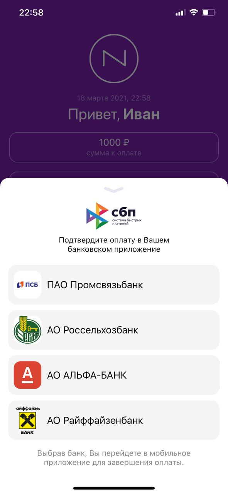

# SBPWidget

[](https://cocoapods.org/pods/SBPWidget)
[](https://cocoapods.org/pods/SBPWidget)
[](https://cocoapods.org/pods/SBPWidget)

### Preview


## Example

To run the example project, clone the repo, and run `pod install` from the Example directory first.

## Requirements

- iOS 11.0+ 
- Swift 5.0+

## Installation

SBPWidget is available through [CocoaPods](https://cocoapods.org). To install
it, simply add the following line to your Podfile:

```ruby
source 'https://github.com/CocoaPods/Specs.git'

pod 'SBPWidget'
```

## Quick Start

```swift
import UIKit
import SBPWidget

class ViewController: UIViewController {
  
  override func viewDidLoad() {
    super.viewDidLoad()
    // Do any additional setup after loading the view, typically from a nib.
  }
  
  override func viewDidAppear(_ animated: Bool) {
    super.viewDidAppear(animated)
    
    SBPWidgetModule().show(on: self) { scheme in
      print(scheme)
    }
  }
}
```

also you need add <b>LSApplicationQueriesSchemes</b> key into you project <b>info.plst</b> 

```plst
 <key>LSApplicationQueriesSchemes</key>
  <array>
    <string>bank100000000000</string>
    <string>bank100000000001</string>
    ...
    <string>bank100000000999</string>
    <string>bank100000001000</string>
  </array>
````

That's need for ```UIApplication.shared.canOpenURL``` method worked correctly.
You can copy and paste all lines from example

## License

SBPWidget is available under the MIT license. See the LICENSE file for more info.
